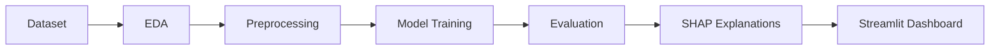

<div align="center">

# 📊 Student Performance ML Dashboard

### An end-to-end machine learning workflow with explainable predictions


</div>

This project analyzes student-performance data and builds regression models to estimate mathematics scores. It covers the full workflow—from exploratory analysis and preprocessing to model evaluation, explainability, an interactive dashboard, and automated PDF reporting.

## Project Goal

The goal is to reproduce the key stages of a practical machine learning project:

- perform exploratory data analysis
- build a reusable preprocessing pipeline
- compare regression models
- evaluate generalization with cross-validation
- explain model behavior with SHAP
- expose results through an interactive Streamlit application
- generate downloadable PDF reports

## Machine Learning Workflow



### Dataset and Target

The project uses the **Students Performance Dataset**.

- **Target:** `math score`
- **Predictors:** reading score, writing score, gender, parental education, lunch type, and test-preparation course

### Preprocessing

- 80/20 train-test split
- `ColumnTransformer` pipeline
- `StandardScaler` for numerical variables
- `OneHotEncoder` for categorical variables
- five-fold cross-validation

### Models

- Linear Regression
- Random Forest Regressor

### Evaluation

Each model is compared using:

- R²
- Mean Absolute Error (MAE)
- Root Mean Squared Error (RMSE)
- mean cross-validation R²

## Explainability

The dashboard goes beyond returning a prediction. It includes:

- Random Forest feature importance
- SHAP value analysis
- actual-versus-predicted visualizations

This makes it possible to inspect which variables influence model behavior instead of treating the model as a black box.

## Findings Observed in the Analysis

- Reading and writing scores are the strongest predictors of mathematics performance.
- Students who completed the test-preparation course tend to obtain better results.
- Lunch type, used in the dataset as a socioeconomic indicator, is associated with performance differences.
- SHAP analysis supports the relevance of the main predictive variables.

These findings describe patterns in this dataset and should not be interpreted as causal conclusions.

## Project Structure

```text
students-performance-ml-dashboard/
├── app.py                 # Streamlit application
├── eda.py                 # Exploratory data analysis
├── ml.py                  # Preprocessing and models
├── utils.py               # Shared utilities
├── report.py              # PDF report generation
├── requirements.txt
├── StudentsPerformance.csv
└── README.md
```

## Run Locally

```bash
git clone https://github.com/AnQuiro20/students-performance-ml-dashboard.git
cd students-performance-ml-dashboard
pip install -r requirements.txt
streamlit run app.py
```

## Tech Stack

Python · Pandas · NumPy · Scikit-learn · SHAP · Plotly · Streamlit · ReportLab

## Author

**Andrés Quirós Rojas**  
Computer Engineering Student — Tecnológico de Costa Rica

[GitHub Profile](https://github.com/AnQuiro20) · [Portfolio](https://anquiro20.github.io/Mi_portafolio/) · [LinkedIn](https://www.linkedin.com/in/andres-quirós-b769a0366)
